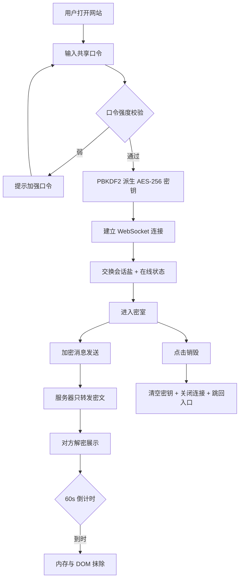

# 双人密聊 · 产品需求文档

## 1. 产品概述
一个极简、加密、双人专用、阅后即焚的私密聊天网站，专注于两个用户之间的安全通信，零注册、零账号、零持久化痕迹。  
面向需要在公共网络下进行点对点私密沟通、要求数据最小化留存与高度隐蔽的用户。  

## 2. 核心功能

### 2.1 用户角色
不设注册与角色系统，两个用户完全对等，仅通过共享口令区分彼此。
| 角色 | 鉴权方式 | 核心权限 |
|------|----------|----------|
| 访客 A | 共享口令 | 进入密室、加密发送/接收消息、阅后即焚 |
| 访客 B | 共享口令 | 进入密室、加密发送/接收消息、阅后即焚 |

### 2.2 功能模块
1. **入口页 / Unlock**：单输入框，输入口令即可进入密室。
2. **密室 / Room**：双人实时聊天，支持文本、图片附件、在线状态、消息回执。
3. **隐身保护层**：默认无痕、退出即清、伪装标题、可疑截图拦截。

### 2.3 页面详情
| 页面 | 模块 | 功能描述 |
|------|------|----------|
| Unlock | 口令输入 | 单一输入框 + "进入"按钮；支持"显示/隐藏"明文；口令派生 AES-256 密钥；失败次数限制 |
| Unlock | 安全提示 | 提示用户选择强口令、不在公共设备使用、不通过明文信道分享口令 |
| Room | 顶部条 | 房间代号（哈希截断）、在线状态点、"清空"按钮、"销毁"按钮 |
| Room | 消息流 | 按时间顺序渲染气泡；左=对方，右=我；支持图片/文字 |
| Room | 输入区 | 多行输入框、附加图片按钮、发送按钮；回车发送、Shift+回车换行 |
| Room | 状态浮层 | 已读/送达回执；对方正在输入指示；密钥指纹对比 |
| 隐身层 | 标题伪装 | 自定义网页标题与图标，应对偷窥者 |
| 隐身层 | 一键销毁 | 离开页面或触发销毁立即清除本地密钥、消息缓存 |

## 3. 核心流程
访客首次进入 → 输入共享口令 → 浏览器内 PBKDF2 派生 AES 密钥 → WebSocket 握手交换临时公钥/会话盐 → 进入密室 → 消息以 AES-GCM 加密后通过 WS 中转 → 对方浏览器解密 → 阅后即焚（60 秒倒计时后从视图与内存中彻底抹除）。  

## 4. 用户界面设计

### 4.1 设计风格
- 极简暗黑风，主色 `#0A0A0B`，辅色 `#EDEDED`，强调色 `#7CFFB2`（在线/已送达），警示色 `#FF5C5C`（销毁/异常）。
- 字体：`JetBrains Mono` / `IBM Plex Mono` 优先，回退 `ui-monospace`。
- 圆角与装饰：4px 圆角；不引入阴影；仅 1px 细线分隔。
- 按钮：方角或 4px 微圆角，悬停时切换文字与下划线，避免按钮感过重。

### 4.2 页面设计概述
| 页面 | 模块 | UI 元素 |
|------|------|----------|
| Unlock | 标题 | 极小字 "密室 / cipher room"，与下划线 |
| Unlock | 输入框 | 1px 边框、零圆角、内嵌提示 "shared passphrase" |
| Unlock | 进入按钮 | 等宽小写 "enter →" |
| Room | 顶部 | 房间代号短哈希 + 状态点 + "burn" 小字按钮 |
| Room | 消息气泡 | 文字左对齐，灰色等宽字，无头像，无 emoji 选择器 |
| Room | 输入栏 | 1px 上分隔线，回车键文字 "send ↵" |

### 4.3 响应式
- 移动优先；最大宽度 560px，居中。
- 安全区：iOS safe-area-inset 全适配，输入栏固定底部，键盘弹起不抖动。
- 触屏：按钮命中区 ≥ 44×44px；输入栏支持聚焦自动滚动。
- 横屏：消息流全宽，气泡贴边。

### 4.4 视觉细节
- 背景使用极淡的扫描线纹理（1px 重复渐变），营造终端感。
- 加载与连接状态使用 `·` `..` `...` 极简点动画。
- 倒计时数字采用 tabular-nums，避免抖动。
