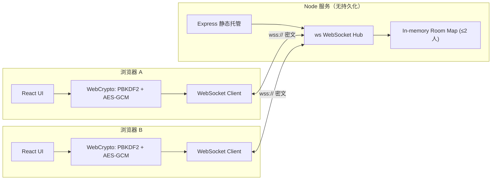
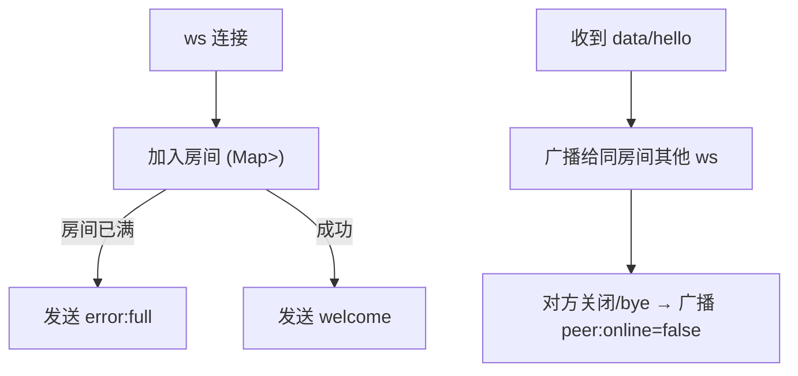

# 双人密聊 · 技术架构文档

## 1. 架构设计
端到端加密 + 最小化服务器中转：服务器只承担密文转发与在线状态广播，所有敏感信息在浏览器端加解密、内存中驻留。



## 2. 技术描述
- 前端：React 18 + TypeScript + Vite + TailwindCSS + zustand
- 后端：Node.js + Express + ws（无数据库、无文件系统写入）
- 加密：浏览器原生 WebCrypto API（AES-GCM 256，PBKDF2 SHA-256，迭代 250000）
- 传输：WebSocket（ws:// 升级 wss://，生产可前置 nginx/caddy）
- 字体：等宽字体（系统 ui-monospace + JetBrains Mono）
- 包管理：默认 pnpm（不可用时降级 npm）

## 3. 路由定义
| 路由 | 用途 |
|------|------|
| `/` | 单页入口，渲染 Unlock/Room |
| `/r/:roomId` | 直链进入密室（口令仍需输入） |
| `/api/health` | 健康检查，返回 204 |

## 4. API 定义
无业务 REST API，仅 WebSocket 协议：

### 4.1 客户端 → 服务器
```ts
type ClientMsg =
  | { t: 'hello'; room: string; saltB64: string }   // 首次加入，携带 PBKDF2 盐
  | { t: 'pub'; payloadB64: string }                // 加密后的任意负载（消息/输入状态/回执）
  | { t: 'bye' };                                   // 主动离开
```

### 4.2 服务器 → 客户端
```ts
type ServerMsg =
  | { t: 'welcome'; peers: 0 | 1; ttl: number }     // 当前密室在线人数与最大 TTL
  | { t: 'peer'; online: boolean }                  // 对方上下线
  | { t: 'data'; from: 'peer'; payloadB64: string } // 转发密文负载
  | { t: 'error'; reason: 'full' | 'banned' | 'rate' };
```

### 4.3 加密负载（payloadB64 解码后）
```ts
type Envelope =
  | { k: 'msg'; iv: string; ct: string; ttl: number }     // AES-GCM 密文 + 阅后即焚秒数
  | { k: 'typing'; on: boolean }
  | { k: 'read'; id: string };
```

## 5. 服务器架构


## 6. 数据模型
无持久化数据模型。所有状态仅驻留内存：
- `rooms: Map<roomId, Set<WebSocket>>`：单实例内存中维护。
- `roomId`：客户端 URL 决定，最多 2 个连接。
- 退出/断开即从 Map 中移除。

### 6.1 内存中的对象
```ts
interface RoomState {
  sockets: Set<WebSocket>;
  // 仅记录在线数量，不存任何业务数据
}
```

### 6.2 安全约束
- 同一 roomId 第三个连接直接 reject。
- 每秒每连接最多 20 条消息（rate limit），超出立即断开。
- 服务端不解析 payloadB64，不记录明文、IP 不落盘（启动时输出 banner 后丢弃）。
- 进程退出/重启时所有内存状态消失。
